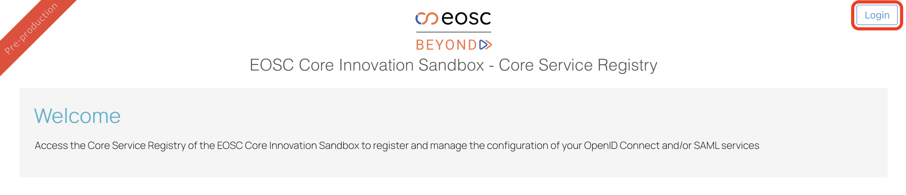
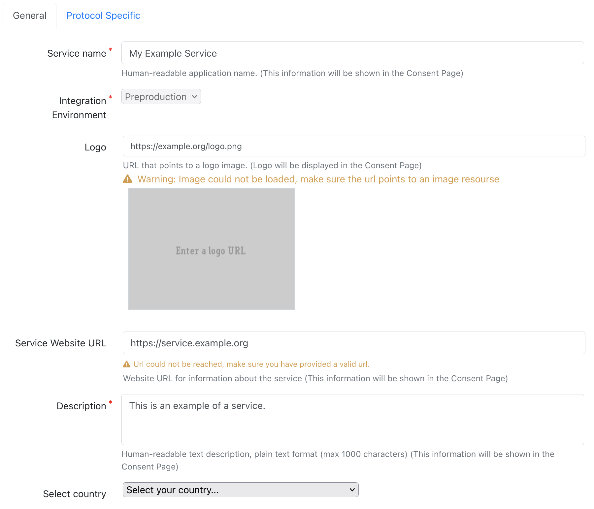
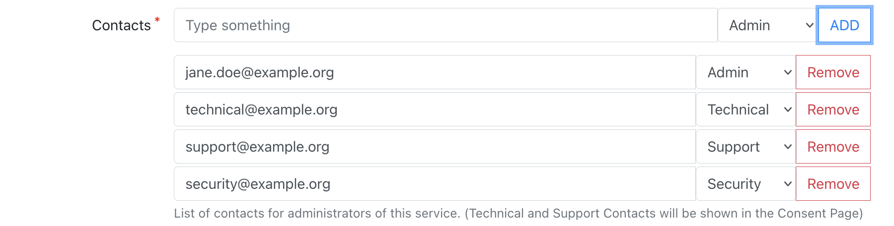
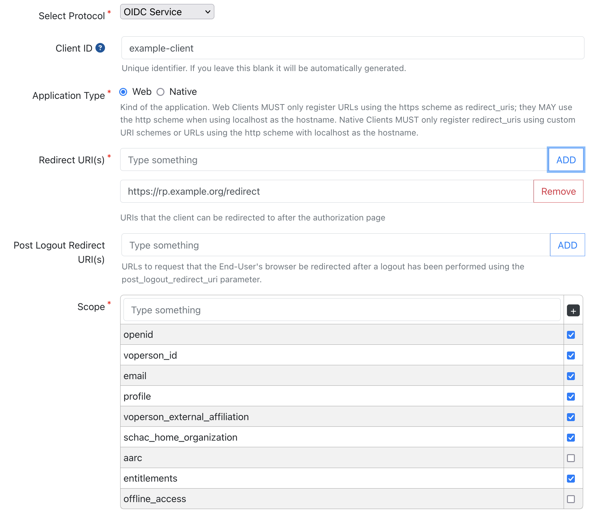
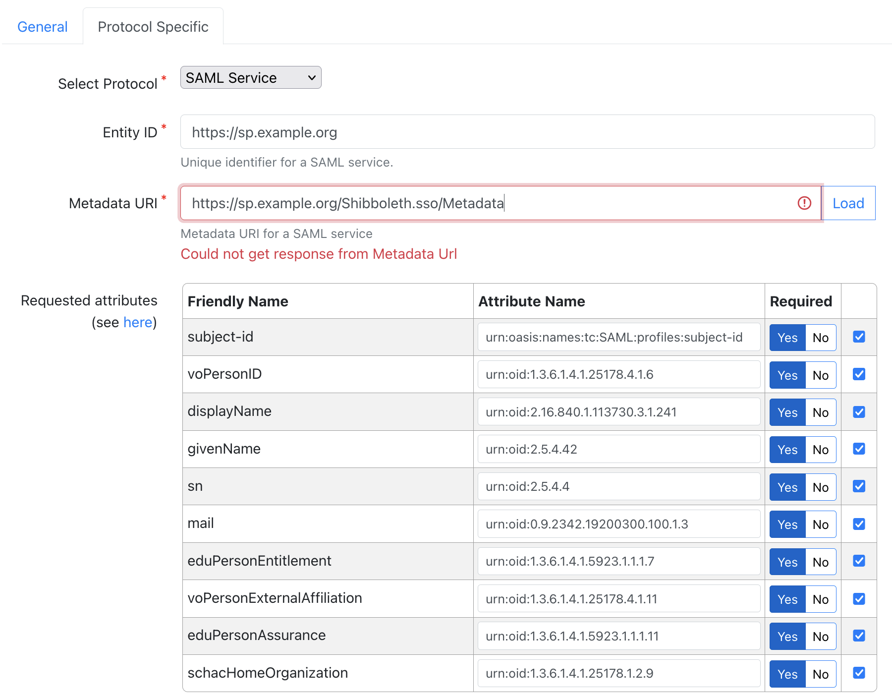
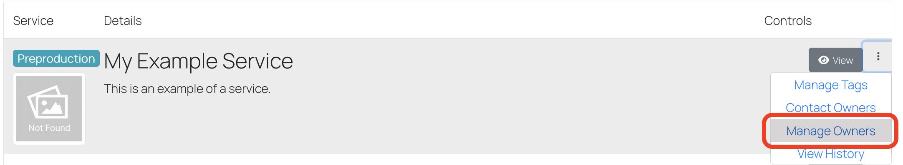

# Service Registration in the EOSC Core Innovation Sandbox via the Core Infrastructure Proxy

## Description

This page explains how to register a service with the Core Infrastructure Proxy. Services can be registered through the Core Service Registry portal using either the OpenID Connect (OIDC) or SAML protocol. Providers of services can use the portal to view and also manage their services by creating and submitting service requests. Both service registration and reconfiguration requests need to be reviewed by the EOSC Core Innovation Sandbox AAI Support Team.

## AAI Endpoints

### OpenID Connect

**Environment** | **Core Infrastructure Proxy OIDC/OAuth2 Issuer**
--- | ---
**Preproduction** | `https://core-proxy.sandbox.eosc-beyond.eu/auth/realms/core`
**Integration** | `https://core-proxy.staging.sandbox.eosc-beyond.eu/auth/realms/core`

The Core Infrastructure Proxy supports OpenID Connect Discovery. OpenID Connect client libraries that support OpenID Connect Discovery will be able to find and configure the appropriate endpoints from the Core Infrastructure Proxy discovery endpoint.

If the OpenID Connect client library your service is using does not support OpenID Connect Discovery, then you can find all the required endpoints at the following URL:

`<issuer>/.well-known/openid-configuration`

### SAML 2.0

**Environment** | **Core Infrastructure Proxy SAML 2.0 Identity Provider Entity ID** | **SAML 2.0 Identity Provider Metadata URL**
--- | --- | ---
**Preproduction** | `https://core-proxy.sandbox.eosc-beyond.eu/auth/realms/core` | [https://core-proxy.sandbox.eosc-beyond.eu/auth/realms/core/protocol/saml/descriptor](https://core-proxy.sandbox.eosc-beyond.eu/auth/realms/core/protocol/saml/descriptor)
**Integration** | `https://core-proxy.staging.sandbox.eosc-beyond.eu/auth/realms/core` | [https://core-proxy.staging.sandbox.eosc-beyond.eu/auth/realms/core/protocol/saml/descriptor](https://core-proxy.staging.sandbox.eosc-beyond.eu/auth/realms/core/protocol/saml/descriptor)

## Registration

To start the registration process, access the Core Service Registry from your browser using the link below:  
[https://core-proxy.sandbox.eosc-beyond.eu/federation](https://core-proxy.sandbox.eosc-beyond.eu/federation)  

Unless you have an active session, you will need to select **"Login"** to authenticate.

After logging into the portal, navigate to **"Manage Services"** and select **"New Service"** to enter the registration form.

### Content of the form

> **ℹ️ Note:**  
> Only the fields marked with a red asterisk * are required.

#### General Service Information

- **Service name** - The name of the service. It will be displayed to end users.
- **Integration Environment** - The target integration environment: **Preproduction** or **Integration**
- **Logo** - A URL with the logo of the service
- **Service Website URL** - The URL of the website or landing page for the service.
- **Description** - Human-readable text description of the service.

#### Contact Information

Email addresses for administrative, security, support, and technical contacts or teams responsible for the service.

- **Admin Contact** - The email address(es) of administrative contact(s)
- **Security Contact** - The email address(es) of security contact(s)
- **Support Contact** - The email address(es) of support/helpdesk contacts
- **Technical Contact** - The email address(es) of technical contact(s)

#### Service Provider Policies

Links to documents with service policies and compliance with mandatory policies of the platform.

- **Privacy Policy (URL)** - A URL pointing to the privacy policy of the service.
- **Acceptable Usage Policy / Terms of Use (URL)** - A URL pointing to the Acceptable Usage Policy and/or Terms of Use of the service.

#### Protocol-specific Information

**Details for OIDC based services**

- **Client ID** - Unique client identifier. Leave blank for automatic generation.
- **Application Type** - Choose Web (default) or Native.
- **Redirect URI(s)** - Specify OIDC redirect URIs for your client. _Wildcards are not supported._
- **Scope(s)** - Define one or more client scopes.

- **Grant Types** - Choose OAuth grant type(s).
  - Default is **Authorization Code**, suitable for both confidential and public clients.
  - Select **Client Credentials** if you need to use the [client credentials grant](https://oauth.net/2/grant-types/client-credentials/) to obtain access tokens on behalf of a service (service account). Do not combine Client Credentials with other grant types.
- **Token Endpoint Authorization Method** - Select authentication method. Use **No authentication** for public clients.
- **Introspection** - Whether the client is allowed to perform OAuth 2.0 Token Introspection. Disabled for public clients.
- **Client secret** - Required for confidential clients.
- **Refresh Tokens** - Whether refresh tokens will be issued for your client.
- **PKCE** - Specify if [Proof Key for Code Exchange - PCKCE](https://oauth.net/2/grant-types/client-credentials/) will be used. Recommended for Authorization Code Flow and mandatory for public clients.

**Details for SAML based services**

- **Entity ID** - Unique identifier for your SAML service (Service Provider - SP entityID).
- **Metadata URI** - Specify a publicly accessible URI serving the metadata for your SAML SP.
- **Requested Attributes** - Specify the attributes requested by your SAML SP.

### Registration Request Submission

After clicking **"Submit"**, you'll receive a confirmation email for your registration request. Users with reviewing privileges will be notified to assess the request. Approved requests are deployed to the requested integration environment. The Support team reviews requests based on the Integration Environment, and you'll be notified via email upon completion. Reviewers can propose changes to the pending request. The proposed changes will be included in the email notification.

## Managing Service Owners

Services are owned by user groups with regular members and group managers. All members can view and submit reconfiguration requests to the service. Group managers have additional privileges, such as inviting/removing members to/from the owners group. When a user requests to register a service, an owners group is automatically created with the requester set as the group manager. To view/manage the owners group, select **"Manage Owners"**.

