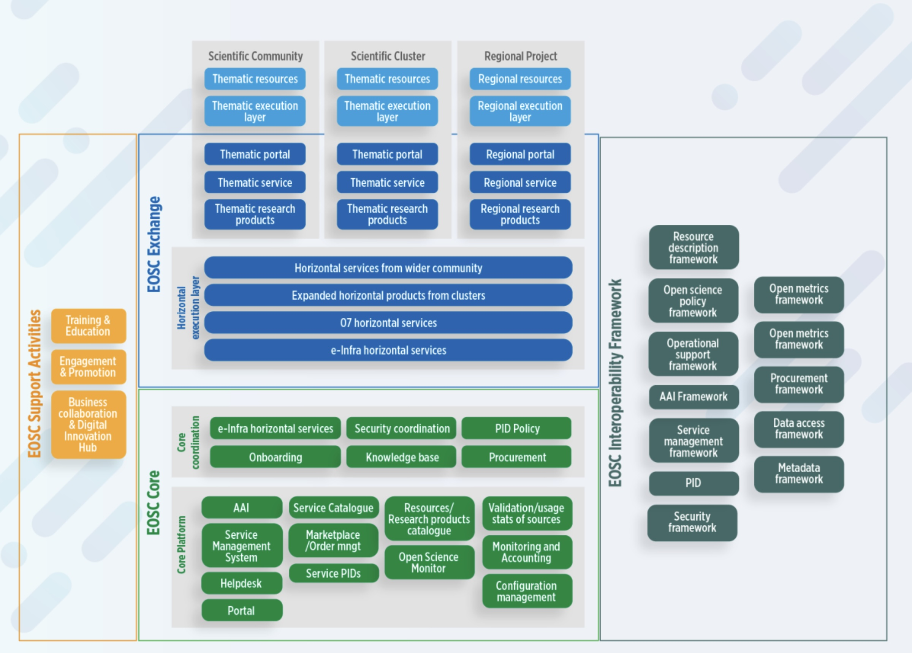

# Onboarding

## Instructions to onboard Service Providers and Services to EOSC

Do you want to onboard your services to the EOSC? In this section, the four main steps for onboarding are described in more detail.

### Who can Onboard Service Providers and Resources?

EOSC Resource Providers provide many kinds of resources – services, data sources, and research products such as actual data, publications, software, etc.  EOSC Resource Providers are part of the "EOSC Exchange" illustrated in the blue section of the architecture diagram below. 

The EOSC architecture has four main parts: 

1. EOSC Exchange (blue) includes services and data sources onboarded to EOSC by research infrastructures, clusters and projects, serving the needs of one or more research communities as well as the general public and private sector. 

2. EOSC Core (green) contains enabling services required to operate the EOSC and the coordination functions.

3. EOSC Interoperability Framework (grey) identifies standards and guidelines that each service can and should comply with to increase the ability of users to connect services into more powerful and useful combinations.

4. EOSC Support activities (orange) complement the other services and include services such as training and the Digital Innovation Hub.

EOSC strives to provide researchers with a wide range of high-quality, interoperable research services, tools and data that will improve researchers’ productivity and enable excellent research. The EOSC Rules of Participation were developed to provide general guidance about how to achieve these objectives.

The EOSC Future project, building on work and practices from predecessor projects (including EOSC Hub, EOSC Enhance, OpenAIRE), has translated the general guidance of the Rules of Participation into specific criteria to be used with Providers (referred to as ‘you’ and ‘your’ in the points below).

### Legal accountability

Legally accountable for the operation of the service or the supply of the research asset.  Your organization must either be a legal entity itself or must identify a legal entity of which you are a part or with which you are affiliated, which entity will take legal responsibility for the resources being onboarded to EOSC.  If your organization is not a legal entity itself, the (separate) legal entity you identify is called the ‘hosting legal entity’ and must first be onboarded as an EOSC Provider in its own right before you or your resources can themselves be onboarded.

